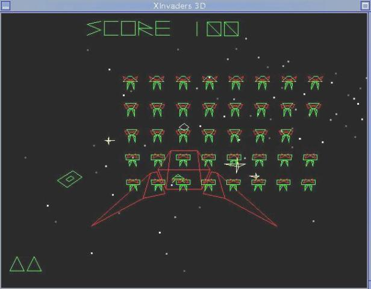

# XInvaders 3D

XInvaders 3D is a vector-graphics Space Invaders clone for the X Window System.

You are a lone star fighter facing endless waves of space aliens.
Your sole objective is to shoot down as many aliens as you can.
All objects are represented with 3D vector graphics, allowing the
aliens to grow in size as they move closer to you.




## Objective:

Clear all the aliens in each level. The UFO yields bonus points if hit. A new life will be added every 7500 points.

Game-over: either if the player has lost all its lives or if the alien formation reaches the player position.


## Point System:

From bottom to top:
```
 - Row 0 aliens yield 10  pts
 - Row 1 aliens yield 50  pts
 - Row 2 aliens yield 100 pts
 - Row 3 aliens yield 150 pts
 - Row 4 aliens yield 200 pts

 - UFO yields 500 pts
```


## Keys:

```
 - SPACE         : Fire Missile
 - Left Arrow    : move left
 - Right Arrow   : move right
 - Up Arrow      : move up
 - Down Arrow    : move down
 - q             : Reset game
 - f             : Show frame-rate
 - p             : Pause game
 - ESC           : Terminate Program
```

## Two Player Duel:

Two players can also play in a duel for highest points.
You will need two keyboards, otherwise it will be difficult to play.

## Two Player Keys:

```
 - a             : Fire Missile
 - i             : move up
 - j             : move left
 - k             : move right
 - m             : move down
 - 1             : lone star fighter mode
 - 2             : two player horizontal split screen
 - 3             : two player vertical split screen
```


## Original Author and Original Website (year2000):

Don Llopis
del23@users.sourceforge.net
http://xinvaders3d.sourceforge.net

### Original Greetings (from Don Llopis, year2000):

Greets to the following people whose games helped inspire this project:

 - Bill Kendrick: who wrote ICBM3d http://www.newbreedsoftware.com
 - Yuusuke Hashimoto: who wrote XSoldier http://www.surfline.ne.jp/hachi/xsoldier.html
 - James Eibisch: who wrote a Space Invaders clone in quick-basic http://www.revolver.demon.co.uk/coding/index.html

Thanks to the following people who contributed to the development of XInvaders3d:

 - Thomas Boutell for contributing the Windows Port of XInvaders, and misc code fixes.
 - Sam Bushell for the ZONE_HEIGHT bug fix.
 - Andreas Jeitler for creating the RPM package.
 - Chris Butler for creating the DEB package.
 - Peter da Silva for the FreeBSD fix.
 - Bill Kendrick for the Window Manager fix.

### Additional Greetings (from Joe Da Silva, year2022):

Fetched a number of past fixes and patches plus did some bug fixes and improvements up to version 1.3.6.
Added updated autoconf, found and fixed a few more quirks and bugs, plus added two player duel mode.


## How To Compile And Play Xinvaders 3D:

There are four different methods you can use.

### 1 - Distro Specific Install

This is always the recommended method.
Install Xinvaders from your distro's repositories.
This will be custom to your distro, and you should be able to find Xinvaders listed in the games menu folder.


### 2 - Original Method

1. Requirements: gcc and Xlib (with include header files)
2. Rename or copy Makefile.lin to Makefile so that you can run make
3. Compile the game, type: make
4. Run the game, type: ./xinvaders3d

Note: You may have to edit the Makefile depending on where your headers and libraries are.

Note: This only creates the binary program xinvaders3d in the same directory.

Note: For other systems please see the README.xxx for that system.

### 3 - Release Tag

For users who do not have autoconf or automake available, there are release tagpoints.
The first release was [![v1.5.0]](https://github.com/JoesCat/xinvaders3d/releases/tag/1.5.0)
Download the -dist- file and expand it so that you can run it.

NOTE: Distros that are planning to follow xinv3d instead of xinvaders3d
should use "./configure --enable-as-xinv3d" to build the project as xinv3d.
The xinv3d option was added with v1.8.0

Installing on Linux
```sh
./configure
make
make check
sudo make install
```
Note: .configure will stop if you are missing any development include headers.

Please install the developer versions of any missing libraries since the include files are also needed for building the program.

The default install location is /usr/local/bin/xinvaders3d and you should also find it in your desktop games menu folder.

### 4 - Latest development files

For users or developers wanting to run the latest update, you will need to install autoconf and automake tools as well as the developer versions of any missing files and libraries.
Then, download the latest code.

Next, you need to create the ./configure script if you do not have it yet
```sh
autoreconf -i  (or use 'autoreconf --install --force' for more modern setups)
automake --foreign -Wall
```
After you have created ./configure, you can run ./configure --help to show other options, or
for a default build and install on Linux, run:
```sh
./configure
make
sudo make install
```
The default install location is /usr/local/bin/xinvaders3d and you should also find icons in your desktop games menu folder.
